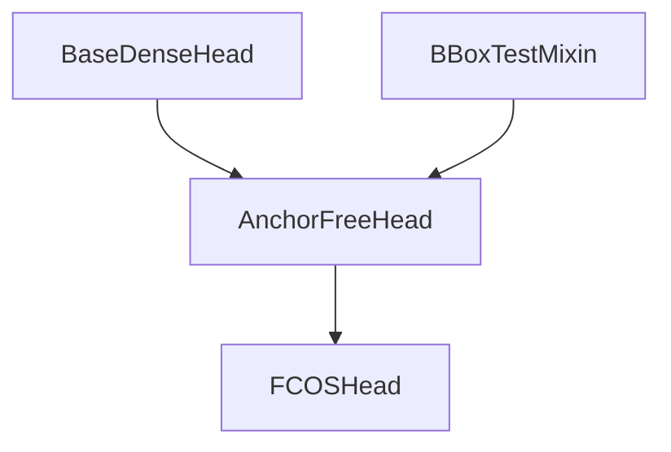
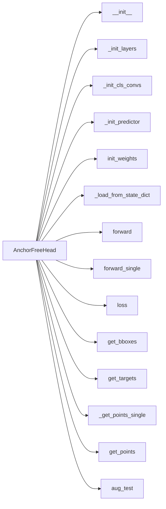
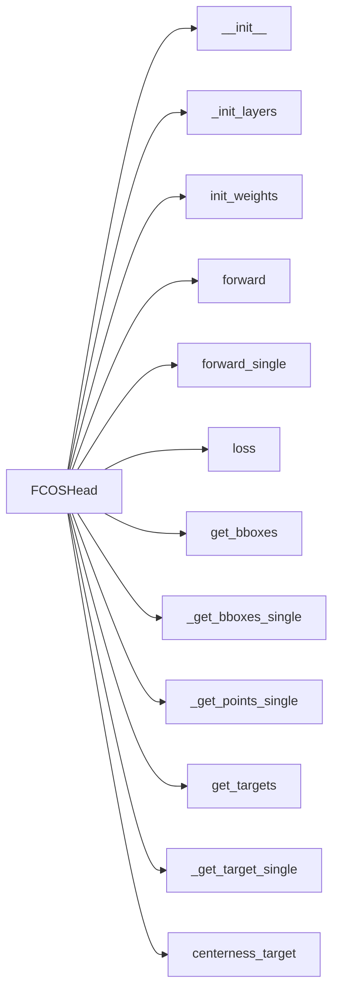

# mmdetection 源码分析 fcos
这篇笔记想分享一下FCOS在mmdetection中的源码实现

笔记参考来源是<https://zhuanlan.zhihu.com/p/112126473>

## fcos代码结构
FCOS核心代码主要使用以下几个类,继承关系如下


AnchorFreeHead类结构图如下

FCOSHead类结构图如下

## fcos代码详解
```python
# mmdetection/mmdet/models/detectors/fcos.py
# FCOS类继承了单阶段检测器类SingleStageDetector
class FCOS(SingleStageDetector):
    """Implementation of `FCOS <https://arxiv.org/abs/1904.01355>`_"""

    def __init__(self,
                 backbone,
                 neck,
                 bbox_head,
                 train_cfg=None,
                 test_cfg=None,
                 pretrained=None):
        super(FCOS, self).__init__(backbone, neck, bbox_head, train_cfg,
                                   test_cfg, pretrained)
```
FCOS类继承了单阶段检测器类，这个和之前Faster R-CNN继承了两阶段检测器一样，实现都在对应的父类里面,所以我们看看SingleStageDetector这个类
```python
# mmdetection/mmdet/models/detectors/single_stage.py
class SingleStageDetector(BaseDetector):
    """Base class for single-stage detectors.

    Single-stage detectors directly and densely predict bounding boxes on the
    output features of the backbone+neck.
    """

    def __init__(self,
                 backbone,
                 neck=None,
                 bbox_head=None,
                 train_cfg=None,
                 test_cfg=None,
                 pretrained=None):
        super(SingleStageDetector, self).__init__()
        # 这里self.backbone就是一个backbone的实例
        self.backbone = build_backbone(backbone)
        if neck is not None:
            self.neck = build_neck(neck)
        bbox_head.update(train_cfg=train_cfg)
        bbox_head.update(test_cfg=test_cfg)
        # 这里self.bbox_head就是一个FCOSHead的实例
        self.bbox_head = build_head(bbox_head)
        self.train_cfg = train_cfg
        self.test_cfg = test_cfg
        self.init_weights(pretrained=pretrained)
```
初始化函数就是创建backbone,neck以及head的实例，其中和Faster R-CNN不一样的只有head使用的是FCOSHead,先继续看SingleStageDetector的实现
```python
# mmdetection/mmdet/models/detectors/single_stage.py
def forward_train(self,
                      img,
                      img_metas,
                      gt_bboxes,
                      gt_labels,
                      gt_bboxes_ignore=None):
        """
        Args:
            img (Tensor): Input images of shape (N, C, H, W).
                Typically these should be mean centered and std scaled.
            img_metas (list[dict]): A List of image info dict where each dict
                has: 'img_shape', 'scale_factor', 'flip', and may also contain
                'filename', 'ori_shape', 'pad_shape', and 'img_norm_cfg'.
                For details on the values of these keys see
                :class:`mmdet.datasets.pipelines.Collect`.
            gt_bboxes (list[Tensor]): Each item are the truth boxes for each
                image in [tl_x, tl_y, br_x, br_y] format.
            gt_labels (list[Tensor]): Class indices corresponding to each box
            gt_bboxes_ignore (None | list[Tensor]): Specify which bounding
                boxes can be ignored when computing the loss.

        Returns:
            dict[str, Tensor]: A dictionary of loss components.
        """
        # 通过backbone和FPN提取多尺度的特征
        x = self.extract_feat(img)
        # 前向计算
        losses = self.bbox_head.forward_train(x, img_metas, gt_bboxes,
                                              gt_labels, gt_bboxes_ignore)
        return losses
```
上面self.bbox_head.forward_train为base_dense_head.py中的forward_train函数,我们来看下
```python
# mmdetection/mmdet/models/dense_heads/base_dense_head.py
def forward_train(self,
                      x,
                      img_metas,
                      gt_bboxes,
                      gt_labels=None,
                      gt_bboxes_ignore=None,
                      proposal_cfg=None,
                      **kwargs):
        """
        Args:
            x (list[Tensor]): Features from FPN.
            img_metas (list[dict]): Meta information of each image, e.g.,
                image size, scaling factor, etc.
            gt_bboxes (Tensor): Ground truth bboxes of the image,
                shape (num_gts, 4).
            gt_labels (Tensor): Ground truth labels of each box,
                shape (num_gts,).
            gt_bboxes_ignore (Tensor): Ground truth bboxes to be
                ignored, shape (num_ignored_gts, 4).
            proposal_cfg (mmcv.Config): Test / postprocessing configuration,
                if None, test_cfg would be used

        Returns:
            tuple:
                losses: (dict[str, Tensor]): A dictionary of loss components.
                proposal_list (list[Tensor]): Proposals of each image.
        """
        # 即FCOSHead的实例调用成员函数forward
        outs = self(x)
        if gt_labels is None:
            loss_inputs = outs + (gt_bboxes, img_metas)
        else:
            loss_inputs = outs + (gt_bboxes, gt_labels, img_metas)
        # 计算loss
        losses = self.loss(*loss_inputs, gt_bboxes_ignore=gt_bboxes_ignore)
        if proposal_cfg is None:
            return losses
        else:
            proposal_list = self.get_bboxes(*outs, img_metas, cfg=proposal_cfg)
            return losses, proposal_list
```
前向的代码封装的非常清晰，那么重点就是在FCOSHead里面了，我们来看这个类,该类主要实现了下图橘色框起来那个三个分支的图（分别是分类H * W *C, 回归 H * W* 4 以及 centerness H * W * 1）以及计算target和loss的代码


网络前向部分比较简单,复杂的地方在后面计算target和loss的部分

```python
# mmdetection/mmdet/models/dense_heads/fcos_head.py
@force_fp32(apply_to=('cls_scores', 'bbox_preds', 'centernesses'))
    def loss(self,
             cls_scores,
             bbox_preds,
             centernesses,
             gt_bboxes,
             gt_labels,
             img_metas,
             gt_bboxes_ignore=None):
        """Compute loss of the head.

        Args:
            cls_scores (list[Tensor]): Box scores for each scale level,
                each is a 4D-tensor, the channel number is
                num_points * num_classes.
            bbox_preds (list[Tensor]): Box energies / deltas for each scale
                level, each is a 4D-tensor, the channel number is
                num_points * 4.
            centernesses (list[Tensor]): Centerss for each scale level, each
                is a 4D-tensor, the channel number is num_points * 1.
            gt_bboxes (list[Tensor]): Ground truth bboxes for each image with
                shape (num_gts, 4) in [tl_x, tl_y, br_x, br_y] format.
            gt_labels (list[Tensor]): class indices corresponding to each box
            img_metas (list[dict]): Meta information of each image, e.g.,
                image size, scaling factor, etc.
            gt_bboxes_ignore (None | list[Tensor]): specify which bounding
                boxes can be ignored when computing the loss.

        Returns:
            dict[str, Tensor]: A dictionary of loss components.
        """
        assert len(cls_scores) == len(bbox_preds) == len(centernesses)
        # 获取FPN各个level的特征图的尺寸（高和宽）
        featmap_sizes = [featmap.size()[-2:] for featmap in cls_scores]
        # 第一步：根据特征图的高和宽计算anchor,详细看下面self.get_points
        all_level_points = self.get_points(featmap_sizes, bbox_preds[0].dtype,
                                           bbox_preds[0].device)
         # 第二步:根据anchor点和gt信息计算target了,详细看下面self.fcos_target
        labels, bbox_targets = self.get_targets(all_level_points, gt_bboxes,
                                                gt_labels)

        num_imgs = cls_scores[0].size(0)
        # cls_scores的每个元素是FPN的每个level的分类预测结果
        # 如Size为([4, 80, 96, 168])代表NCHW,C为类别数目－１
        # permute后变为([4, 96, 168, 80]),reshape后变为(64512, 80)
        # flatten cls_scores, bbox_preds and centerness
        flatten_cls_scores = [
            cls_score.permute(0, 2, 3, 1).reshape(-1, self.cls_out_channels)
            for cls_score in cls_scores
        ]
        flatten_bbox_preds = [
            bbox_pred.permute(0, 2, 3, 1).reshape(-1, 4)
            for bbox_pred in bbox_preds
        ]
        flatten_centerness = [
            centerness.permute(0, 2, 3, 1).reshape(-1)
            for centerness in centernesses
        ]
        # 将flatten的各个level的tensor拼接起来
        flatten_cls_scores = torch.cat(flatten_cls_scores)
        flatten_bbox_preds = torch.cat(flatten_bbox_preds)
        flatten_centerness = torch.cat(flatten_centerness)
        # labels和bbox_targets是这个batch里各个图的相同level的点anchor的标签拼起来的list
        # list每个元素为一个tensor,list的长度为level的数目，
        # 所以cat完就是所有level的target放到一整个tensor了
        # 这些步骤和上面转换预测结果是一致的，举例说明：
        # flatten_cls_scores的size是（所有点的预测结果，80）
        # flatten_labels的size是（所有点的预测结果，），存的值是对应的类别的编号
        flatten_labels = torch.cat(labels)
        flatten_bbox_targets = torch.cat(bbox_targets)
        # repeat points to align with bbox_preds
        flatten_points = torch.cat(
            [points.repeat(num_imgs, 1) for points in all_level_points])

        # FG cat_id: [0, num_classes -1], BG cat_id: num_classes
        bg_class_ind = self.num_classes
        # 找到正样本的索引和数目
        pos_inds = ((flatten_labels >= 0)
                    & (flatten_labels < bg_class_ind)).nonzero().reshape(-1)
        num_pos = len(pos_inds)
        # 这边loss_cls是focal-loss
        loss_cls = self.loss_cls(
            flatten_cls_scores, flatten_labels,
            avg_factor=num_pos + num_imgs)  # avoid num_pos is 0

        pos_bbox_preds = flatten_bbox_preds[pos_inds]
        pos_centerness = flatten_centerness[pos_inds]

        # 只对正样本计算loss
        if num_pos > 0:
            # 根据框的target计算centerness的target，是一个[0,1]之间的连续值，１代表中心
            pos_bbox_targets = flatten_bbox_targets[pos_inds]
            pos_centerness_targets = self.centerness_target(pos_bbox_targets)
            pos_points = flatten_points[pos_inds]
            # 这里要把target转换回框的信息，因为我们要用iou_loss
            pos_decoded_bbox_preds = distance2bbox(pos_points, pos_bbox_preds)
            pos_decoded_target_preds = distance2bbox(pos_points,
                                                     pos_bbox_targets)
            # centerness weighted iou loss
            loss_bbox = self.loss_bbox(
                pos_decoded_bbox_preds,
                pos_decoded_target_preds,
                weight=pos_centerness_targets,
                avg_factor=pos_centerness_targets.sum())
             # 这边注意下算centerness的loss的时候用的是BCE
            loss_centerness = self.loss_centerness(pos_centerness,
                                                   pos_centerness_targets)
        else:
            loss_bbox = pos_bbox_preds.sum()
            loss_centerness = pos_centerness.sum()

        return dict(
            loss_cls=loss_cls,
            loss_bbox=loss_bbox,
            loss_centerness=loss_centerness)
```

这里来看下get_points这个生成anchor的过程

```python
def get_points(self, featmap_sizes, dtype, device, flatten=False):
        """Get points according to feature map sizes.

        Args:
            featmap_sizes (list[tuple]): Multi-level feature map sizes.
            dtype (torch.dtype): Type of points.
            device (torch.device): Device of points.

        Returns:
            tuple: points of each image.
        """
        mlvl_points = []
        # 对FPN的每个level循环
        for i in range(len(featmap_sizes)):
            # 下面可以看到append的是当前level的(h*w, 2)个点
            mlvl_points.append(
                self._get_points_single(featmap_sizes[i], self.strides[i],
                                        dtype, device, flatten))
        return mlvl_points
def _get_points_single(self,
                           featmap_size,
                           stride,
                           dtype,
                           device,
                           flatten=False):
        """Get points of a single scale level."""
        h, w = featmap_size
        x_range = torch.arange(w, dtype=dtype, device=device)
        y_range = torch.arange(h, dtype=dtype, device=device)
        y, x = torch.meshgrid(y_range, x_range)
        if flatten:
            y = y.flatten()
            x = x.flatten()
        return y, x
def _get_points_single(self,
                           featmap_size,
                           stride,
                           dtype,
                           device,
                           flatten=False):
        """Get points according to feature map sizes."""
        # 把feature map的每个点映射回原图
        y, x = super()._get_points_single(featmap_size, stride, dtype, device)
        #如公式(xs*stride + stride // 2,ys*stride + stride // 2)
        points = torch.stack((x.reshape(-1) * stride, y.reshape(-1) * stride),
                             dim=-1) + stride // 2
        return points
```

这里来看下self.fcos_target这个生成target的过程

```python
    def get_targets(self, points, gt_bboxes_list, gt_labels_list):
        """Compute regression, classification and centerss targets for points
        in multiple images.

        Args:
            points (list[Tensor]): Points of each fpn level, each has shape
                (num_points, 2).
            gt_bboxes_list (list[Tensor]): Ground truth bboxes of each image,
                each has shape (num_gt, 4).
            gt_labels_list (list[Tensor]): Ground truth labels of each box,
                each has shape (num_gt,).

        Returns:
            tuple:
                concat_lvl_labels (list[Tensor]): Labels of each level. \
                concat_lvl_bbox_targets (list[Tensor]): BBox targets of each \
                    level.
        """
        assert len(points) == len(self.regress_ranges)
        num_levels = len(points)
        # expand_as这个函数就是把一个tensor变成和函数括号内一样形状的tensor
        # [None]是对应维度增加一维度
        # 这里就是把FPN各个层对应的尺度限制转化一下size方便下面用
        # 一般情况就是五个范围：regress_ranges=
        # ((-1, 64), (64, 128), (128, 256), (256, 512),(512, INF))
        # expand regress ranges to align with points
        expanded_regress_ranges = [
            points[i].new_tensor(self.regress_ranges[i])[None].expand_as(
                points[i]) for i in range(num_levels)
        ]
        
        # concat all levels points and regress ranges
        concat_regress_ranges = torch.cat(expanded_regress_ranges, dim=0)
        # concat_points代表把各个level的anchor点按照0维拼接一下
        # points的第ｉ个元素的size为（hi*wi，２），拼接完的shape为(所有level的点的数目，2)
        # 之所以合并是为了丢到一个tensor里一起算
        concat_points = torch.cat(points, dim=0)

        # the number of points per img, per lvl
        num_points = [center.size(0) for center in points]

        # get labels and bbox_targets of each image
        # 对一个batch里的每个图单独算，可以到下面这个函数fcos_target_single
        # 可以看到是算的每个图的每个anchor点的分类target和回归target，然后拼成list
        labels_list, bbox_targets_list = multi_apply(
            self._get_target_single,
            gt_bboxes_list,
            gt_labels_list,
            points=concat_points,
            regress_ranges=concat_regress_ranges,
            num_points_per_lvl=num_points)

        # split to per img, per level
        # num_points代表每个level里anchor点的数目
        labels_list = [labels.split(num_points, 0) for labels in labels_list]
        bbox_targets_list = [
            bbox_targets.split(num_points, 0)
            for bbox_targets in bbox_targets_list
        ]

        # concat per level image
        concat_lvl_labels = []
        concat_lvl_bbox_targets = []
        for i in range(num_levels):
            # 把这个batch里各个图的相同level的点anchor的标签拼起来
            concat_lvl_labels.append(
                torch.cat([labels[i] for labels in labels_list]))
            bbox_targets = torch.cat(
                [bbox_targets[i] for bbox_targets in bbox_targets_list])
            if self.norm_on_bbox:
                bbox_targets = bbox_targets / self.strides[i]
            concat_lvl_bbox_targets.append(bbox_targets)
        # 总之，我们是拿到了每个batch里每个图的每个level的点anchor的分类标签和回归标签了
        # 回到loss函数继续看
        return concat_lvl_labels, concat_lvl_bbox_targets
```
接下来看下_get_bboxes_single这个函数,该函数用于计算每张图像的target
```python
    def _get_target_single(self, gt_bboxes, gt_labels, points, regress_ranges,
                           num_points_per_lvl):
        """Compute regression and classification targets for a single image."""
        num_points = points.size(0)
        num_gts = gt_labels.size(0)
        if num_gts == 0:
            return gt_labels.new_full((num_points,), self.num_classes), \
                   gt_bboxes.new_zeros((num_points, 4))
		# gt_bboxes的size为（num_gts，4）
        # 所以areas就是算各个gt的面积，size为（num_gts，）
        areas = (gt_bboxes[:, 2] - gt_bboxes[:, 0]) * (
            gt_bboxes[:, 3] - gt_bboxes[:, 1])
        # TODO: figure out why these two are different
        # areas = areas[None].expand(num_points, num_gts)
        # repeat是把对应维度复制（一维要向上补），size为（num_points，num_gts）
        areas = areas[None].repeat(num_points, 1)
        regress_ranges = regress_ranges[:, None, :].expand(
            num_points, num_gts, 2)
        # gt_bboxes的size为（num_gts，4）,加个[None]就是加一维，变为[1,num_gts，4]
        # 继续expand变为指定维度(num_points, num_gts, 4)
        gt_bboxes = gt_bboxes[None].expand(num_points, num_gts, 4)
        # points之前说了size为（num_points，2),所以xs就是（num_points，）
        xs, ys = points[:, 0], points[:, 1]
        # 所以[:, None]就是（num_points，1）,expand之后就是（num_points，num_gts）
        xs = xs[:, None].expand(num_points, num_gts)
        ys = ys[:, None].expand(num_points, num_gts)
		
        # gt_bboxes的size为(num_points, num_gts, 4)
        # 取[..., 0]后变为(num_points, num_gts)
        # 所以很明显这里其实就是每个点和每个框之间的上下左右的差值
        left = xs - gt_bboxes[..., 0]
        right = gt_bboxes[..., 2] - xs
        top = ys - gt_bboxes[..., 1]
        bottom = gt_bboxes[..., 3] - ys
        # stack完了之后就变为(num_points, num_gts，4)
        bbox_targets = torch.stack((left, top, right, bottom), -1)

        if self.center_sampling:
            # condition1: inside a `center bbox`
            radius = self.center_sample_radius
            center_xs = (gt_bboxes[..., 0] + gt_bboxes[..., 2]) / 2
            center_ys = (gt_bboxes[..., 1] + gt_bboxes[..., 3]) / 2
            center_gts = torch.zeros_like(gt_bboxes)
            stride = center_xs.new_zeros(center_xs.shape)

            # project the points on current lvl back to the `original` sizes
            lvl_begin = 0
            for lvl_idx, num_points_lvl in enumerate(num_points_per_lvl):
                lvl_end = lvl_begin + num_points_lvl
                stride[lvl_begin:lvl_end] = self.strides[lvl_idx] * radius
                lvl_begin = lvl_end

            x_mins = center_xs - stride
            y_mins = center_ys - stride
            x_maxs = center_xs + stride
            y_maxs = center_ys + stride
            center_gts[..., 0] = torch.where(x_mins > gt_bboxes[..., 0],
                                             x_mins, gt_bboxes[..., 0])
            center_gts[..., 1] = torch.where(y_mins > gt_bboxes[..., 1],
                                             y_mins, gt_bboxes[..., 1])
            center_gts[..., 2] = torch.where(x_maxs > gt_bboxes[..., 2],
                                             gt_bboxes[..., 2], x_maxs)
            center_gts[..., 3] = torch.where(y_maxs > gt_bboxes[..., 3],
                                             gt_bboxes[..., 3], y_maxs)

            cb_dist_left = xs - center_gts[..., 0]
            cb_dist_right = center_gts[..., 2] - xs
            cb_dist_top = ys - center_gts[..., 1]
            cb_dist_bottom = center_gts[..., 3] - ys
            center_bbox = torch.stack(
                (cb_dist_left, cb_dist_top, cb_dist_right, cb_dist_bottom), -1)
            inside_gt_bbox_mask = center_bbox.min(-1)[0] > 0
        else:
            # 找到（l,r,t,b）中最小的，如果最小的大于０，
            # 那么这个点肯定在对应的gt框里面，则置true，否则为false
            # condition1: inside a gt bbox
            inside_gt_bbox_mask = bbox_targets.min(-1)[0] > 0

        # condition2: limit the regression range for each location
        max_regress_distance = bbox_targets.max(-1)[0]
        # 找到（l,r,t,b）中最大的，如果最大的满足范围约束，则置１，否则为０
        inside_regress_range = (
            (max_regress_distance >= regress_ranges[..., 0])
            & (max_regress_distance <= regress_ranges[..., 1]))

        # if there are still more than one objects for a location,
        # we choose the one with minimal area
        # areas的size为（num_points，num_gts），我们将框外面的点对应的area置为无穷
        areas[inside_gt_bbox_mask == 0] = INF
        # 将不满足范围约束的也置为无穷，因为下面的代码要找最小的
        areas[inside_regress_range == 0] = INF
        # 找到每个点对应的面积最小的gt框（因为可能有多个，论文取了最小的）
        # min_area和min_area_inds的size都为(num_points,)
        min_area, min_area_inds = areas.min(dim=1)
		
        # labels的size为(num_gts,),gt_labels[min_area_inds]的操作就是
        # 生成和min_area_inds的size一样的tensor,每个位置的值是索引对应的gt_label值
        # 所以labels的size为（num_points,），即为每个点的label
        labels = gt_labels[min_area_inds]
        # 注意一下把负样本置80，因为如果点是负样本，则areas.min(dim=1)因为都是INF
        labels[min_area == INF] = self.num_classes  # set as BG
        # 生成的bbox_targets的size为(num_points，4),即每个点对应的target
        bbox_targets = bbox_targets[range(num_points), min_area_inds]
		
        # 所以返回值为每个点的分类label和回归target
        # size分别为(num_points,)和(num_points，4)
        return labels, bbox_targets
```

fcos训练的过程基本就是这样了

